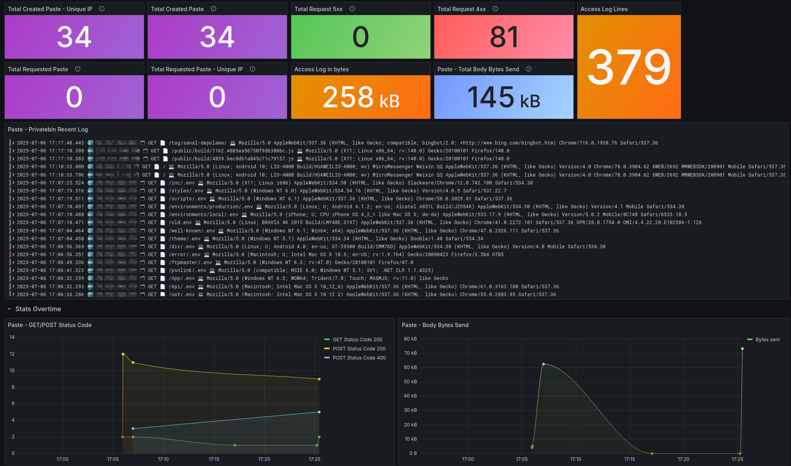
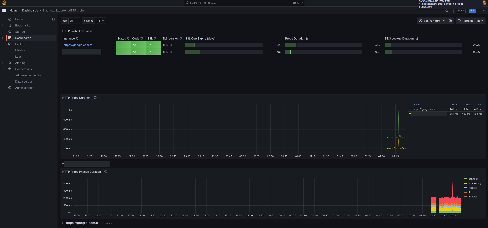

# Grafana Monitoring Stack

Tek bir `docker compose` ile kurulan sunucu izleme yığını: **Grafana + Prometheus +
Loki**. Sistem metrikleri, site erişilebilirlik kontrolü, nginx trafik analizi ve
SSH giriş logları tek yerde.

Dashboard'lar repoyla birlikte gelir — klonla, `up` de, hazır.




## İçinde ne var

| Servis | Ne yapar | Port |
|---|---|---|
| **grafana** | arayüz | `127.0.0.1:3000` |
| **prometheus** | metrik toplar | `127.0.0.1:9090` |
| **node-exporter** | cpu / ram / disk / network | `127.0.0.1:9100` |
| **blackbox-exporter** | site up/down, SSL, yanıt süresi | `127.0.0.1:9115` |
| **loki** | log deposu | `127.0.0.1:3100` |
| **promtail** | nginx + auth loglarını Loki'ye taşır | `127.0.0.1:9080` |

Her servis `127.0.0.1`'e bağlıdır; hiçbiri dışarıdan doğrudan erişilemez.
Grafana'ya nasıl bağlanacağın aşağıda.

## Hızlı başlangıç

```bash
git clone <repo-url> monitoring && cd monitoring
cp .env.example .env               # şifreyi değiştir
docker network create monitoring   # bir kereye mahsus, aşağıya bak
docker compose up -d
```

> **`monitoring` ağını neden elle oluşturuyoruz?**
> `docker-compose.yml` ağı `external: true` ile kullanır, yani compose onu
> oluşturmaz — hazır bulmayı bekler. Böylece ağın adı ve subnet'i proje
> adından bağımsız ve sabit kalır. Reverse proxy'de konteyner subnet'ine
> göre yazılmış bir `allow` kuralın varsa (blackbox-exporter'ın kendi
> Grafana'nı problaması için gerekir) bu kural `down`/`up` döngülerinde
> bozulmaz. Ağ yoksa `up` şunu der:
> `network monitoring declared as external, but could not be found`.

Grafana `127.0.0.1:3000`'e bağlıdır, dışarı kapalıdır. Tarayıcıdan açmak için
en hızlı yol SSH tüneli:

```bash
ssh -L 3000:127.0.0.1:3000 kullanici@sunucu
# sonra tarayıcıda: http://localhost:3000
```

Giriş: `admin` / `.env`'de belirlediğin şifre.

Kalıcı erişim istiyorsan önüne nginx/caddy gibi bir reverse proxy + TLS koy.
Portu doğrudan dışarı açmak yerine proxy'nin arkasında bırak.

> Şifreyi unutursan `.env` işe yaramaz — `.env` yalnızca `grafana-data`
> volume'ü **boşken**, ilk açılışta uygulanır. Sonrasında şifre Grafana'nın
> kendi veritabanındadır. Sıfırlamak için:
> `docker exec -it grafana grafana-cli admin reset-admin-password 'yeni'`

Datasource'lar (Prometheus + Loki) ve 6 dashboard otomatik yüklenir, elle bir şey
eklemene gerek yok.

> `.env`'deki şifre yalnızca ilk açılışta, `grafana-data` volume'ü boşken uygulanır.
> Sonrasında şifre Grafana'nın kendi veritabanında tutulur.

## Ön koşullar

Yığın **Debian/Ubuntu** varsayar. İki dosya promtail'e bağlanır:

```
/var/log/nginx/access.log    nginx trafik logları
/var/log/auth.log            SSH giriş denemeleri
```

> ⚠️ **Bind mount kaynağı yoksa Docker onu dizin olarak oluşturur.** Promtail hata
> vermez, sadece hiçbir şey okumaz; dashboard'lar boş kalır ve sebebi görünmez.
> Başlamadan önce `ls -la /var/log/auth.log` ile kontrol et.

### SSH logları

| Dağıtım | Yol | Yapılacak |
|---|---|---|
| Debian / Ubuntu | `/var/log/auth.log` | hazır, bir şey yapma |
| RHEL / Rocky / Fedora | `/var/log/secure` | `docker-compose.yml`'deki mount'u ve `promtail/promtail.yaml`'daki `__path__`'i değiştir |
| Sadece journald | dosya yok | `rsyslog` kur, ya da promtail'in `journal` scrape'ine geç |

Bunun dışında ek ayar gerekmez; SSH dashboard'u ham `sshd` satırlarını kendi ayrıştırır.

### Nginx access logları — JSON formatı gerekiyor

Nginx dashboard'u `| json` parser'ı kullanır. **Nginx varsayılan `combined`
formatında yazarsa dashboard tamamen boş gelir.**

```bash
sudo cp nginx/log-json.conf /etc/nginx/conf.d/log-json.conf
# nginx.conf'taki http{} bloğunda mevcut "access_log ..." satırını yorum satırı yap
sudo nginx -t && sudo systemctl reload nginx
```

Doğrula — çıktı JSON olmalı:

```bash
tail -n1 /var/log/nginx/access.log
```

Promtail bu JSON'daki `host` alanını Loki label'ına çevirir; dashboard'un stream
seçicisi buna dayanır. Bu adım atlanırsa paneller "No data" der.

#### Host listesinde tanımadığın domainler varsa

Dashboard'un `host` listesi, isteklerin gönderdiği `Host` başlığından gelir.
IP'ni tarayan botlar ve DNS kaydı senin IP'ni gösteren yabancı domainler de
buraya düşer.

`promtail/promtail.yaml`'daki yorum satırı hâlindeki `match` bloğunu açıp kendi
domainini yazarsan Loki'ye sadece senin sitenin satırları gider.

Nginx kullanmıyorsan `promtail/promtail.yaml`'daki `nginx` bloğunu ve
`docker-compose.yml`'deki `/var/log/nginx` mount'unu sil.

## Yapılandırma

### İzlenen siteler

`prometheus.yml` → `blackbox` job'undaki `targets` listesi. Şu an repo sahibinin
adresleri duruyor, kendi domainlerinle değiştir:

```yaml
    static_configs:
      - targets:
          - https://website.com.tr
          - https://grafana.website.com.tr
```

```bash
docker compose restart prometheus
```

### Kendi trafiğini istatistikten çıkarmak

Nginx dashboard'undaki paneller genel gürültüyü (bot, crawler, `/wp-*`,
`wordfence`, `robots.txt`, `xmlrpc.php`) zaten eliyor. Kendi IP'ni ya da izleme
sistemlerini de elemek istersen, panelin sorgusuna bir satır ekle:

```logql
| remote_addr != "1.2.3.4"
```

Konteynerlerin kendi trafiğini elemek için (blackbox-exporter kendi Grafana'nı
problar) aynı şekilde konteyner IP'sini ekleyebilirsin — `docker inspect` ile
öğrenirsin. Bu repo bilinçli olarak hiçbir IP'yi sabit içermez.

### Yeni log kaynağı

`promtail/promtail.yaml`'a bir `scrape_configs` girdisi ekle, log dosyasını da
`docker-compose.yml`'de promtail'e `:ro` olarak mount et.

## Dashboard'lar

`grafana/dashboards/` altındaki dosyalar açılışta otomatik yüklenir.

| Dashboard | Ne gösterir |
|---|---|
| 1 Linux Stats with Node Exporter | cpu, ram, disk, network |
| Analytics - NGINX | trafik, durum kodları, en çok istenen sayfalar |
| SSH Logs | başarılı/başarısız giriş denemeleri, kaynak IP'ler |
| Promtail Monitoring | log toplayıcının kendi sağlığı |
| Blackbox Exporter (HTTP prober) | site up/down, SSL süresi, yanıt süresi |
| Prometheus Blackbox Exporter | detaylı probe metrikleri |

### Dashboard'ları değiştirmek

Bu repoda `allowUiUpdates: true` ayarlı, yani provisioned dashboard'ları
**arayüzden düzenleyip kaydedebilirsin**. Kayıt Grafana'nın deposuna yazılır.

Alternatif olarak `grafana/dashboards/*.json` dosyasını düzenleyebilirsin;
provisioning 30 saniyede bir tarar, restart gerekmez.

> **Aynı dashboard için ikisini karıştırma.** JSON dosyası değişirse *dosya*
> kazanır ve arayüzdeki düzenlemelerin üzerine yazar. Arayüzdeki hâli repoya
> kalıcı işlemek için: **Export → JSON**, çıkanı ilgili dosyaya yaz.

#### Grafana 12/13'te kaydetme çalışmıyorsa

Grafana 13 dashboard'ları "unified storage"da tutar ve her kaydın üzerine
`grafana.app/managerAllowsEdits` etiketini koyar. Bu etiket, dashboard JSON
dosyası **ilk provision edildiği andaki** `allowUiUpdates` değerinden gelir.

Sonuç: `dashboard.yml`'yi sonradan değiştirip Grafana'yı yeniden başlatmak
tek başına yetmez. JSON dosyasının checksum'ı değişmediyse Grafana "bunu
zaten işledim" deyip kaydı güncellemez, etiket eski değeriyle kalır ve
arayüz `Cannot save provisioned dashboard` deyip JSON'ı indirtir.

Çözüm — checksum'ı değiştirip yeniden provision ettir:

```bash
printf '\n' >> grafana/dashboards/*.json
docker compose restart grafana
```

Yeni dashboard eklemek için JSON'ı `grafana/dashboards/` altına koyman yeterli.

## Dosya yapısı

```
docker-compose.yml
prometheus.yml                     prometheus scrape ayarları
loki/loki-config.yaml
promtail/promtail.yaml             log kaynakları + host label çıkarımı
nginx/log-json.conf                nginx JSON log formatı (kopyalanacak)grafana/provisioning/datasources/  Prometheus + Loki tanımı
grafana/provisioning/dashboards/   dashboard yükleyici
grafana/dashboards/*.json          dashboard'ların kendisi
```

## Bilinen sınırlar

- **Ülke kırılımı paneli boş kalır.** Nginx dashboard'u `geoip_country_code`
  alanını bekler; bu alan nginx'in `ngx_http_geoip2_module`'ü kurulu değilse
  üretilmez.
- Grafana varsayılan olarak `127.0.0.1:3000`'e bağlıdır, dışarıdan erişilemez.
  Doğrudan açmak istersen `docker-compose.yml`'de `"3000:3000"` yap — ama o
  zaman önüne TLS + kimlik doğrulama koymadan bırakma.
- `monitoring` ağı `external: true`; `docker network create monitoring` ile
  önceden oluşturulmuş olmalı.
- Compose proje adı `grafana` olarak sabitlenmiştir (`name: grafana`), böylece
  volume adları dizin adından bağımsızdır.

## Veri kalıcılığı

Her şey adlandırılmış volume'lerde durur: `grafana_grafana-data`,
`grafana_prometheus-data`, `grafana_loki-data`, `grafana_promtail-positions`.

`docker compose down` bunlara dokunmaz. Silmek için `docker compose down -v`.

## Kaynaklar

Dashboard'lar topluluk çalışmalarına dayanıyor:

- [Blackbox Exporter (HTTP prober)](https://grafana.com/grafana/dashboards/13659) — gnetId 13659
- [Prometheus Blackbox Exporter](https://grafana.com/grafana/dashboards/7587) — gnetId 7587
- [Promtail Monitoring](https://grafana.com/grafana/dashboards/20881) — gnetId 20881
- [VoidQuark Grafana Dashboards](https://github.com/voidquark/grafana-dashboards)
- [PrivateBin Access Log](https://grafana.com/grafana/dashboards/19507-privatebin-access-log/)
- [SSH Logs](https://grafana.com/grafana/dashboards/17514-ssh-logs/)

Bu repo iki ayrı projenin birleşimidir:
[blackbox-exporter-docker](https://github.com/murat-akpinar/blackbox-exporter-docker) ve
[nginx-monitoring](https://github.com/murat-akpinar/nginx-monitoring).

## Lisans

[GNU GPL v3](LICENSE)
